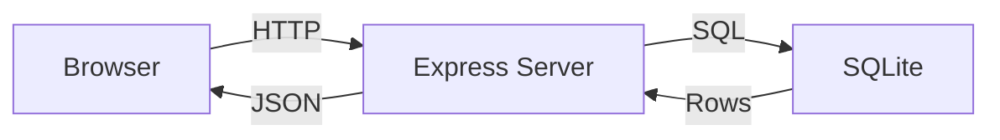

<<<<<<< HEAD
# Relatório Técnico - Vendaas (Vendas de Produtos)

## Arquitetura



Fluxo de request para listagem de produtos:
1. Browser faz GET /produtos?search=&categoria=&sort=
2. Express recebe, valida parâmetros
3. Query SQL construída com WHERE/ORDER BY conforme filtros
4. SQLite executa e retorna rows
5. Express serializa para JSON
6. Browser recebe e renderiza grid/table

## Tecnologias e Versões

Backend:
- Node.js + Express 4.18.2 (servidor web)
- SQLite3 5.1.6 (banco de dados)
- UUID 9.0.0 (IDs únicos)
- Nodemon 2.0.22 (dev reload)

Frontend:
- HTML5 + CSS3 (layout responsivo)
- JavaScript (ES6+, Fetch API, localStorage)
- Fonte Poppins (Google Fonts)

VS Code + Copilot ajudaram especialmente em:
- Queries SQL com LIKE para busca
- Validações de formulário
- Grid responsivo CSS
- Atributos ARIA para acessibilidade

## Prompts do Copilot Mais Úteis

1. "Create an Express + SQLite API for products and cart"
   - Sugeriu esquema SQL e helper functions
   - Mantive a estrutura mas ajustei validações

2. "Add aria attributes for cart drawer accessibility"
   - Sugeriu aria-pressed, aria-hidden, aria-live
   - Implementei conforme sugestão

3. "Implement persistent sort using localStorage"
   - Sugeriu padrão de localStorage key
   - Adaptei para incluir mais estados (carrinho, cupom)

4. "Add product form validation front and back"
   - Sugeriu regex e ranges numéricos
   - Ajustei para regras específicas (estoque ≥ 0, etc)

5. "Create responsive product grid with cards"
   - Sugeriu CSS Grid com auto-fit
   - Mantive e ajustei gaps/breakpoints

6. "Add toast notifications for feedback"
   - Sugeriu componente toast
   - Estendi para mais casos de erro

## Peculiaridades Implementadas

1. **Acessibilidade (1)**
   - ARIA roles e states no drawer do carrinho
   - Labels e feedback para screen readers
   - Foco visual em controles
   - Descrições claras para ações

2. **Ordenação persistida (4)**
   - Sort order salvo em localStorage
   - Restaurado ao carregar página
   - Select com opções de ordem
   - Persiste entre sessões

3. **Tratamento de erros com toasts (9)**
   - Feedback visual via toast
   - Mensagens claras de erro/sucesso
   - HTTP status codes apropriados
   - Validação client + server

## Validações

Frontend:
```js
// Produto nome (3-60 chars)
if (!data.nome || data.nome.length < 3 || data.nome.length > 60) {
  showError('nome', 'Nome deve ter entre 3 e 60 caracteres');
}

// Preço (>= 0.01)
if (!data.preco || data.preco < 0.01) {
  showError('preco', 'Preço deve ser maior que R$ 0,01');
}
```

Backend:
```js
// Validação de estoque
if (!Number.isInteger(Number(estoque)) || Number(estoque) < 0) {
  return res.status(400).json({ error: 'estoque deve ser inteiro >= 0' });
}

// Validação de carrinho
if (produto.estoque < quantidade) {
  return res.status(400).json({ error: 'Estoque insuficiente' });
}
```

## Como Rodar

1. Clone e instale dependências:
```bash
git clone https://github.com/seu-usuario/dw2-seunome-vendaas
cd dw2-seunome-vendaas
npm install
```

2. Inicie o servidor:
```bash
npm run dev
```

3. Acesse no navegador:
- Loja: http://localhost:3000
- Admin: http://localhost:3000/admin.html

O banco SQLite será criado em `data/vendaas.db` com seeds automáticos.

## Limitações e Melhorias Futuras

Limitações atuais:
- Sem autenticação no admin
- Imagens são placeholders
- Sem persistência de pedidos
- Validações básicas de formulário

Melhorias possíveis:
- Autenticação JWT para admin
- Upload de imagens
- Histórico de pedidos
- Mais validações (SKU único, etc)
- Testes automatizados
- Dark mode
- Paginação ou scroll infinito
- Export CSV/JSON
=======
# Relatório Técnico — Vendaas (Vendas de Produtos)

## Objetivo
Construir um mini-sistema web para Vendas de Produtos com frontend (HTML/CSS/JS) e backend (FastAPI + SQLite).

## Estrutura do projeto
- frontend/
  - index.html
  - styles.css
  - scripts.js
- backend/
  - app.py
  - models.py
  - database.py
  - seed.py
  - requests.http
- package.json (opcional para frontend tooling)
- README.md
- REPORT.md
- ChatIA.md (conversas com a IA)

## Como rodar
1. Backend (recomendado em ambiente virtual):

```powershell
cd backend
python -m venv .venv
.\.venv\Scripts\Activate.ps1
pip install -r requirements.txt
python -m backend.seed
uvicorn backend.app:app --reload --port 8000
```

2. Frontend:
- Abra `frontend/index.html` no navegador (ou sirva com um servidor estático).
- O frontend consome a API em `http://localhost:8000`.

## APIs implementadas
- GET /produtos?search=&categoria=&sort=
- POST /produtos
- PUT /produtos/{id}
- DELETE /produtos/{id}
- POST /carrinho/confirmar

## Regras de negócio implementadas
- Não permitir adicionar ao carrinho se estoque = 0 (front e back)
- Ao confirmar pedido: validar estoque, aplicar cupom ALUNO10 (10% off), reduzir estoque e criar um registro de pedido (simplificado)

## Testes manuais
- Use `backend/requests.http` ou Thunder Client para testar os endpoints.

## Acessibilidade
- Inputs com `aria-label` onde aplicável.
- Modal gerenciado via `aria-hidden` e foco inicial.
- Atalho Alt+N para abrir modal Novo Produto.

## Observações
- Armazenamento em memória no frontend (localStorage) e SQLite para o backend.
- Este projeto é um esqueleto adequado para avaliação; pode ser expandido com autenticação, uploads e testes automatizados.

